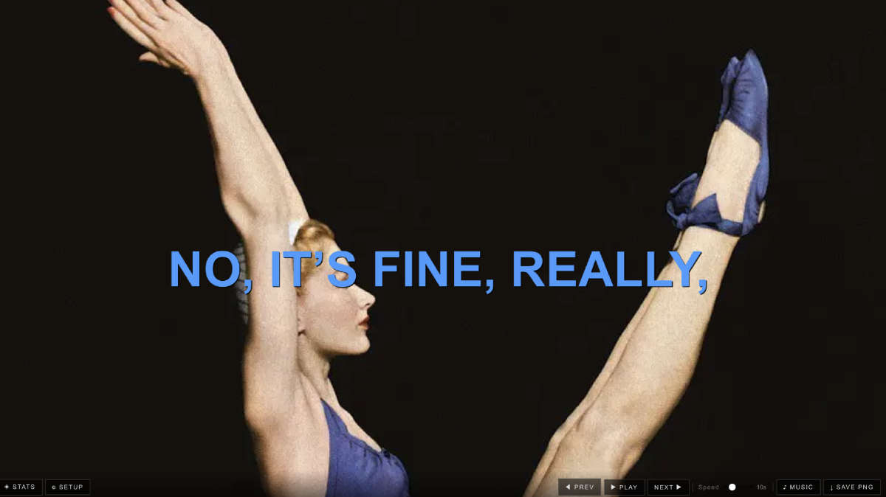
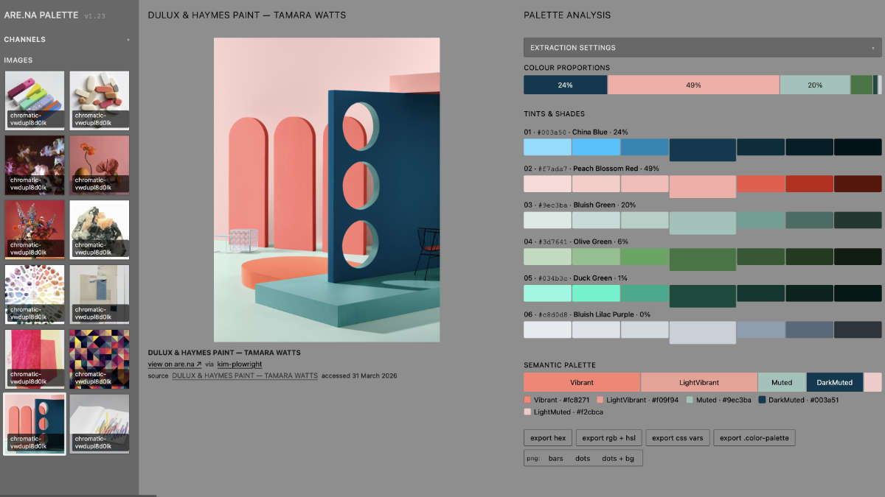
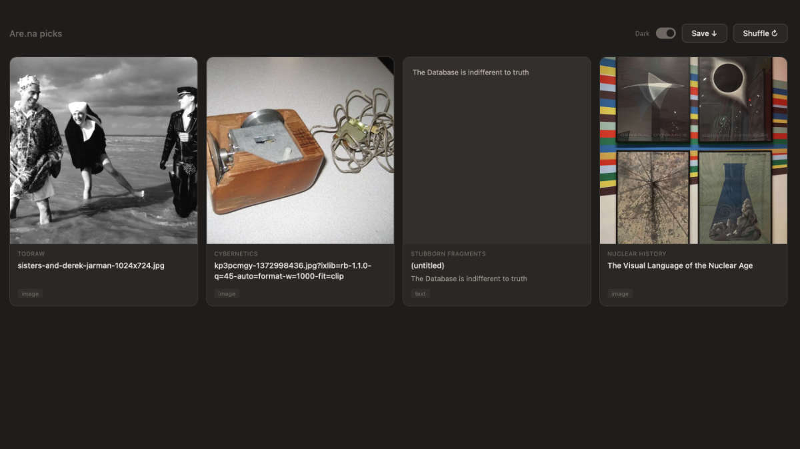

# are.na toolkit

Browser tools for working with [are.na](https://www.are.na). Vanilla JS, no build step, no accounts — open a file and go.

**[→ All tools](https://mildlydiverting.github.io/are.na-toolkit/)** · Built by [Kim Plowright](https://www.are.na/kim-plowright/channels)

---

## Are.na Hypernormalisation



**[Try it](https://mildlydiverting.github.io/are.na-toolkit/arena-hypernormalisation.html)**

Pull images and text from are.na channels and combine them into a strangely familiar documentary critique of late capitalism. Inspired by [Adam Curtis](https://www.bbc.co.uk/webarchive/https%3A%2F%2Fwww.bbc.co.uk%2Fblogs%2Fadamcurtis%2Fentries%2F02d9ed3c-d71b-4232-ae17-67da423b5df5), [Tom Scott](https://www.tomscott.com/infinite-adam-curtis/), and [Dan Williams](https://www.iamdanw.com).

Good for full-screen ambient displays, or just staring into the void. Feel free to add to the default [images](https://www.are.na/kim-plowright/hypernormalisation-images) and [text fragments](https://www.are.na/kim-plowright/hypernormalisation-text) channels on are.na.

**What it does:**
- Fetches images and short text blocks from any public are.na channels you specify
- Composites them into full-screen intertitle slides: bold uppercase text over a background image, in white, blue, magenta, or red
- Plays automatically on a timer (3–30 seconds per slide, adjustable)
- Shuffles content so every item appears before any repeats
- Lazily fetches deeper pages in the background as you watch — the slide playback rate acts as a natural API throttle
- Optional SoundCloud or local audio soundtrack
- Export any frame as a 1920×1080 PNG

**Advanced settings** (collapsed by default, in order): access token for private channels, keyword search, block blocklist, custom audio.

**File:** `arena-hypernormalisation/index.html` — single self-contained file, ~2000 lines.

### Setup screen

| Field | What to enter |
|---|---|
| Image channels | are.na channel URLs or slugs — images become backgrounds, default https://www.are.na/kim-plowright/hypernormalisation-images |
| Text channels | are.na channel URLs or slugs — text blocks become captions, default https://www.are.na/kim-plowright/hypernormalisation-text |
| (Advanced) Access token | Optional. Needed for private channels and search. Get it at [are.na → Settings → Developers](https://www.are.na/developers/personal-access-tokens). Saved to `localStorage`. |
| (Advanced) Search are.na | Optional. Keyword(s) to search public are.na blocks; leave blank for recent public blocks. Requires access token. |
| (Advanced) Block blocklist | Optional. Paste are.na block URLs to exclude specific blocks from the canvas. |
| (Advanced) Music | Optional. SoundCloud playlist URL, direct MP3/OGG URL, or local audio file. Muted by default — press ♪ Music to start. |

Enter key submits any text field. Channels accept full URLs (`https://www.are.na/user/slug`) or bare slugs. Settings (channels, searches, audio URL) persist across sessions via `localStorage`.

### Display mode

#### Keyboard shortcuts

| Key | Action |
|---|---|
| `→` or `N` | Next slide |
| `←` or `P` | Previous slide |
| `Space` | Play / Pause autoplay |
| `M` | Toggle music |
| `S` | Save PNG |
| `D` | Toggle Info Panel |
| `Escape` | Back to setup |

#### Controls bar (bottom)

Fades in on mouse movement, out after ~3 seconds. Click the canvas to toggle.

`⚙ Setup` — returns to settings (stops playback and audio)  
`◈ Info` — opens Pool Inspector panel (right side)  
`◀ Prev` / `▶ Play` / `Next ▶` — navigation and autoplay  
`Speed` — slider, 3–30 seconds per slide  
`♪ Music` — toggle audio (hidden if no audio source set)  
`↓ Save PNG` — exports current frame at 1920×1080

### Info / Pool Inspector / Stats panel

Shows live state of the content pool. Accessible via `◈ Info` button or `D` key.

- **Pool** — "↻ Fetch fresh" button: clears cache for all active sources and re-fetches, merging only new items into the live bags without interrupting playback. "✕ Clear all cache" wipes every cached entry.
- **Images / Texts** — total pool size, items remaining until a full repeat cycle, and per-source breakdown.
- **History** — how many slides have been shown and current position (for back/forward).
- **Cache entries** — each cached key with age, green (fresh) or red (expired). Each has its own `✕` delete button.

---

## Are.na Palette



**[Try it](https://mildlydiverting.github.io/are.na-toolkit/arena-palette.html)**

Extract colour palettes from images in your are.na channels. Click an image to pull its dominant colours, name them, and export in whatever format your tools need.

**What it does:**
- Fetches image blocks from one or more are.na channels
- Extracts dominant colours using [Color Thief](https://lokeshdhakar.com/projects/color-thief/)
- Names each colour via the [color.pizza API](https://github.com/meodai/color-name-api)
- Generates tints and shades for each colour
- Builds a semantic palette: dominant, accent, background, highlight, contrast
- Proportion bar showing the visual weight of each colour
- Dark / mid / light theme toggle for previewing palettes in context

**Export formats:** hex list · RGB · HSL · CSS custom properties · SCP JSON · Adobe Swatch Exchange (.ase) · GIMP palette (.gpl) · Procreate palette (.palette) · PNG swatch sheet

**Build:** `arena-palette/src/` contains `template.html`, `main.js`, and `style.css`. Run `python3 arena-palette/build.py` to produce `arena-palette/dist/arena-palette.html` and copy to `docs/`.

---

## Are.na Picks



**[Try it](https://mildlydiverting.github.io/are.na-toolkit/arena-picks.html)**

A random-block browser for are.na channels. Good for creative inspiration, serendipitous juxtaposition, and finding things you forgot you'd saved.

**What it does:**
- Shows a configurable grid of random blocks from one or more are.na channels
- Lock the blocks you want to keep, then shuffle the rest
- Mix images, text, links, and attachments in the same grid
- Export a zip file of your favourite combinations
- Settings panel for channels and display options, persisted in localStorage

**File:** `are.na-picks/index.html` — standalone single file, lives in the sibling `are.na-picks` repo.

---

## Technical notes

All three tools share the same constraints:

- **Vanilla JS only** — no npm, no bundler, no backend
- **Single HTML files** — open directly in a browser or serve with `python3 -m http.server`
- **are.na REST API v3** — `https://api.are.na/v3/` — all API calls use v3 exclusively
- **localStorage** — channel preferences, access tokens, and fetched content (24h TTL) are all stored client-side
- **No tracking, no ads, no accounts** — tools work with your browser and are.na's public API

### Running locally

```bash
# any tool
python3 -m http.server 8080
# open http://localhost:8080/arena-hypernormalisation/
```

CORS on canvas export requires the page to be served (not opened as `file://`).

### are.na access token

Required only for private channels and keyword search (v3 API restriction). Get one at [are.na → Settings → Developers](https://www.are.na/developers/personal-access-tokens). Read-only access is sufficient.

### Palette build

```bash
python3 arena-palette/build.py
# → arena-palette/dist/arena-palette.html
# copy to docs/ manually or cp arena-palette/dist/arena-palette.html docs/arena-palette.html
```

### Are.na Hypernormalisation — Fetching, Caching & Throttling

- Channel content is cached in `localStorage` per channel slug + page number, with a 24-hour TTL. Stale entries are deleted on read.
- On "Go", only **page 1** of each channel is fetched. Subsequent pages are loaded incrementally in the background.
- Background top-up triggers every **25 slides**, silently fetching the next page of each channel and appending new images/texts to the pool.
- Search queries are also cached per query string, same 24-hour TTL.
- A **150ms delay** is inserted between paginated requests ("polite pacing").
- On an HTTP **429 (rate limited)** response, retries with exponential backoff: 2s → 4s → 8s. If the server sends a `Retry-After` header, that value is used instead. After three retries it makes one final attempt and fails. The status bar shows a countdown during the wait.
- The Info panel has a "Fetch fresh" button (manual top-up) and a "Clear all cache" button (nukes everything, re-fetches on next Go).
- Prefs (channels, blocklist, API key, etc.) are stored separately in `localStorage` and never expire.

### Are.na Hypernormalisation — Music

- Default audio is a hardcoded SoundCloud playlist (`soundcloud.com/mildlydiverting/sets/are-na-hypernormalisation`).
- You can override with: a SoundCloud playlist URL, a direct MP3/OGG URL, or a local file.
- **Muted by default** — the SC widget prefetches and cues the first shuffled track on Go, but does not auto-play. User must press ♪ Music.
- The SoundCloud widget loads in a hidden 1×1px iframe; the SC Widget API controls playback.
- On load, it fetches all tracks in the playlist, **shuffles** them, and plays in shuffled order. When exhausted, reshuffles (guaranteed different order).
- A direct MP3/OGG URL or local file plays via a standard `<audio>` element at 50% volume, looping.
- The SC iframe starts loading **in parallel** with channel fetching (prefetched immediately on Go).
- The ♪ Music button toggles mute/unmute; hidden if no audio is configured.
- Returning to Setup pauses audio.

### Are.na Hypernormalisation — Block blocklist

- `DEFAULT_BLOCKLIST_IDS` — a hardcoded `Set` of block IDs (integers) that are always excluded, regardless of user settings. Not shown in the UI.
- `S.blocklist` — user-managed array of block IDs, persisted in `localStorage`. Managed via the Block blocklist section in Advanced Settings.
- `isBlocklisted(b)` checks both before `extractImages` and `extractTexts` map their blocks.
- Block URLs are parsed to extract the integer ID; only the ID is stored.

### Are.na Hypernormalisation — Alt text & accessibility

- `blockAlt(b)` builds an alt string from the v3 API response: `image.alt_text` (if set by the are.na user) → `title` (if not a bare filename like `IMG_4032.jpg`) → first line of `description.plain` → `"Image from are.na"` as fallback.
- Image objects in `S.allImages` carry `{ url, alt, source }`.
- History entries carry `imageAlt`. `showEntry` sets `canvas.aria-label` to `"[alt] — [caption text]"` on each slide render.
- All form inputs are associated to visible `<label>` elements. Dynamic regions (`#status`, `#error-area`, `#audio-status`) use `aria-live`. Toggle buttons use `aria-pressed`. Chip remove buttons have descriptive `aria-label` values.

---

## Repo structure

```
are.na-toolkit/
├── docs/                          # GitHub Pages — live tools + screenshots
│   ├── index.html                 # Tool directory
│   ├── arena-hypernormalisation.html
│   ├── arena-palette.html
│   ├── arena-picks.html
│   └── *.jpg                      # Screenshots
├── arena-hypernormalisation/
│   └── index.html                 # Single-file tool
├── arena-palette/
│   ├── src/                       # Source files (template, JS, CSS)
│   ├── dist/                      # Built output
│   └── build.py                   # Concat builder
└── are.na-picks/                  # Sibling repo (submodule or separate clone)
    └── index.html
```

---

*Open source [https://github.com/mildlydiverting/are.na-toolkit/blob/main/LICENSE](MIT) license — do what you like with it. Found a bug? [Open an issue](https://github.com/mildlydiverting/are.na-toolkit/issues).*
